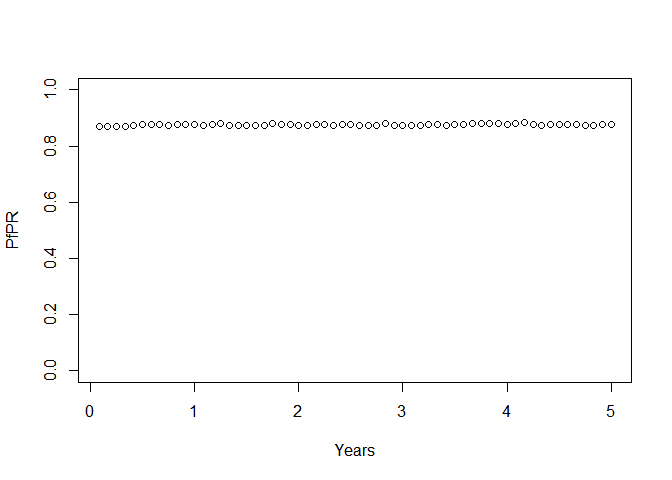

# MAGENTA package tutorial overview
OJ Watson  
`r format(Sys.time(), '%d %B, %Y')`  

## Overview

The MAGENTA package provides an individual based model of human malaria transmission.
The model is written in c++ and has been interfaced with R through Rcpp. The simulation 
starts by producing the “equilibrium” solution in the R interface using an adapted ODE
version of the Imperial Collage malaria transmission model (Griffin et al. 2016), 
which is passed to the c++ along with any required parameters. At the moment the 
model ignores mosquitoes and parasite strains, and simply has the population-level 
size of the infected mosquito population (Iv in former models) provided as a parameter 
from the steady state output for a desired EIR/seasonal setting. 

The package can be viewed in 3 major parts (excluding installation):

0. Installation
1. Parameter lists
2. Simulation
3. MCMC

These 3 parts will be demonstrated in the following tutorial and will give an idea
of how the structure of MAGENTA works. 

## 0. Package Loading

As included in the README, the package can be installed using devtools in the conventional way:


```r
# First make sure the package is installed
#devtools::install_github("OJWatson/MAGENTA",auth_token = "810def9e944ff0ab2ae39ea5b9a00447de0eda40") 
# Load package
library(MAGENTA)
```

## 1. Parameter lists

Model simulations within MAGENTA are initialized using the same R function, which 
accepts a parameter list object as an argument. Within MAGENTA there are 3 (eventually 4)
parameter list creation functions. Each will create a parameter list object that the 
R simulation function \code{Simulation_R} recognizes and passes onto the related 
c++ simulation function.

To begin with a parameter list will need to be created for initializing a model state
from equilibrium. This can be achieved by the following:


```r
## Create initial parameter list, changine any key parameters, e.g. the average age
mpl <- MAGENTA::Model_Param_List_Create(eta = 1/(21*365))

## Create a near equilibirum initial condition
eqInit <- MAGENTA::Equilibrium_Init_Create(age.vector = c(0,0.25,0.5,0.75,1,1.5,1.75,2,3.5,5,7.5,10,15,20,30,40,50,60,70,80,90,100),
                                  het.brackets = 5,
                                  ft = 0.4,
                                  EIR = 120,
                                  model.param.list = mpl)

## Next create the near equilibrium steady state
eqSS <- MAGENTA::Equilibrium_SS_Create(eqInit = eqInit, end.year=5)

## Now check and create the final parameter list for use in the Rcpp simulation initialisation, and initialise for 2 years 
## (Simulation_Init doesn't introduce any pending infections so the system needs to equilibriate a bit)
pl <- MAGENTA::Param_List_Simulation_Init_Create(N=10000,
                                                 years=2,
                                                 eqSS=eqSS)

## View the paramter list object
str(pl)
```

```
## List of 3
##  $ N    : num 10000
##  $ years: num 2
##  $ eqSS :List of 14
##   ..$ age_brackets    : num [1:22] 0 91.2 182.5 273.8 365 ...
##   ..$ het_brackets    : num [1:5] 0.0108 0.0753 0.434 2.5021 17.4144
##   ..$ Smat            : num [1:22, 1:5] 0.00013 0.000126 0.000122 0.000119 0.000228 ...
##   ..$ Dmat            : num [1:22, 1:5] 1.01e-07 1.22e-07 1.39e-07 1.54e-07 3.33e-07 ...
##   ..$ Amat            : num [1:22, 1:5] 1.79e-06 3.30e-06 4.57e-06 5.64e-06 1.39e-05 ...
##   ..$ Umat            : num [1:22, 1:5] 4.47e-07 1.06e-06 1.70e-06 2.30e-06 6.35e-06 ...
##   ..$ Tmat            : num [1:22, 1:5] 6.72e-08 8.15e-08 9.24e-08 1.02e-07 2.22e-07 ...
##   ..$ Pmat            : num [1:22, 1:5] 2.20e-07 3.06e-07 3.57e-07 4.00e-07 8.77e-07 ...
##   ..$ IBmat           : num [1:22, 1:5] 0.0505 0.1085 0.1735 0.2453 0.3958 ...
##   ..$ ICAmat          : num [1:22, 1:5] 0.0303 0.0657 0.1059 0.1507 0.2472 ...
##   ..$ ICMmat          : num [1:22, 1:5] 1.02 2.00e-12 8.59e-13 3.68e-13 1.01e-13 ...
##   ..$ IDmat           : num [1:22, 1:5] 0.0298 0.0641 0.1025 0.1449 0.2338 ...
##   ..$ Iv              : num 0.859
##   ..$ MaternalImmunity: num 44.8
```

```r
str(pl$eqSS)
```

```
## List of 14
##  $ age_brackets    : num [1:22] 0 91.2 182.5 273.8 365 ...
##  $ het_brackets    : num [1:5] 0.0108 0.0753 0.434 2.5021 17.4144
##  $ Smat            : num [1:22, 1:5] 0.00013 0.000126 0.000122 0.000119 0.000228 ...
##  $ Dmat            : num [1:22, 1:5] 1.01e-07 1.22e-07 1.39e-07 1.54e-07 3.33e-07 ...
##  $ Amat            : num [1:22, 1:5] 1.79e-06 3.30e-06 4.57e-06 5.64e-06 1.39e-05 ...
##  $ Umat            : num [1:22, 1:5] 4.47e-07 1.06e-06 1.70e-06 2.30e-06 6.35e-06 ...
##  $ Tmat            : num [1:22, 1:5] 6.72e-08 8.15e-08 9.24e-08 1.02e-07 2.22e-07 ...
##  $ Pmat            : num [1:22, 1:5] 2.20e-07 3.06e-07 3.57e-07 4.00e-07 8.77e-07 ...
##  $ IBmat           : num [1:22, 1:5] 0.0505 0.1085 0.1735 0.2453 0.3958 ...
##  $ ICAmat          : num [1:22, 1:5] 0.0303 0.0657 0.1059 0.1507 0.2472 ...
##  $ ICMmat          : num [1:22, 1:5] 1.02 2.00e-12 8.59e-13 3.68e-13 1.01e-13 ...
##  $ IDmat           : num [1:22, 1:5] 0.0298 0.0641 0.1025 0.1449 0.2338 ...
##  $ Iv              : num 0.859
##  $ MaternalImmunity: num 44.8
```

```r
## Simulate
sim.out <- MAGENTA::Simulation_R(pl)
```

```
## [1] "R function is working!"
## Rcpp function is working!
## Matrix unpacking working!
## Pre human-initialisation working!
## Human initilisation working
## Time elapsed in initialisation: 0 seconds
## 100 days
## 200 days
## 300 days
## 400 days
## 500 days
## 600 days
## 700 days
## Time elapsed total: 2 seconds
## S | D | A | U | T | P:
## 0.1101 | 0.0038 | 0.7875 | 0.0869 | 0.0038 | 0.0079 |
```

The end object, \code{pl}, is a list object with 3 elements, representing the desired
population size, length of initialization for simulation to be carried out for on the c++
side, and a further list with equilibrium state objects derived from the equilibrium. When this
parameter list is passed as an argument to \code{Simulation_R}, a model state will be initialized
and simulated before returning a list containing an external pointer to the model state, 
along with some loggers for the system. This list can then be used as a further argument
in creating the second type of parameter list accepted by \code{Simulation_R}:


```r
## Create new parameter list dictating how long we want to continue the simulation for
## and specifying the external pointer to thh model state in memory
pl2 <- MAGENTA::Param_List_Simulation_Update_Create(years = 12/12,
                                                    statePtr = sim.out$Ptr)

## View the paramter list object
str(pl2)
```

```
## List of 2
##  $ years   : num 1
##  $ statePtr:<externalptr>
```

```r
## Simulate
sim.out <- MAGENTA::Simulation_R(pl2)
```

```
## [1] "R function is working!"
## Rcpp function is working!
## Pointer unpacking working!
## Starting susceptible population: 0.1101
## Time elapsed in initialisation: 0 seconds
## 800 days
## 900 days
## 1000 days
## Time elapsed total: 1 seconds
## S | D | A | U | T | P:
## 0.1156 | 0.0035 | 0.7753 | 0.0915 | 0.0046 | 0.0095 |
```

In the above we can see that we have passed back to the simulation the model state through
its pointer, and how long we want the simulation to continue for. By breaking up simulations
this way we can generate live logging of the model at whatever interval we desire without
having to go into the c++. We can also validate the above is working as desired by checking
in the 2 former model print outputs that the final susceptible population size from sim.out is
the same as the initial susceptible population size in sim.out2. 

We can continue the above process indefinitely, however at some point we may want to save
the model state to file so that it can be used again. To do this, we create our third 
parameter list object:


```r
## Create new parameter list containing just the model state pointer
pl3 <- MAGENTA::Param_List_Simulation_Get_Create(statePtr = sim.out$Ptr)

## View the paramter list object
str(pl3)
```

```
## List of 1
##  $ statePtr:<externalptr>
```

```r
## Simulate
sim.save <- MAGENTA::Simulation_R(pl3)
```

```
## [1] "R function is working!"
## Rcpp function is working!
## Pointer unpacking working!
```

```r
## Save
saveRDS(sim.save,"savedState.rds")

## View object
str(sim.save,list.len=18,vec.len = 1)
```

```
## List of 3
##  $ population_List:List of 19
##   ..$ Infection_States                  : int [1:10000] 3 2 ...
##   ..$ Zetas                             : num [1:10000] 0.0266 ...
##   ..$ Ages                              : int [1:10000] 10007 8293 ...
##   ..$ IB                                : num [1:10000] 287 ...
##   ..$ ICA                               : num [1:10000] 469 ...
##   ..$ ICM                               : num [1:10000] 2.13e-27 ...
##   ..$ ID                                : num [1:10000] 173 ...
##   ..$ IB_last_boost_time                : int [1:10000] 986 1089 ...
##   ..$ ICA_last_boost_time               : int [1:10000] 986 1092 ...
##   ..$ ID_last_boost_time                : int [1:10000] 986 1089 ...
##   ..$ IB_last_calculated_time           : int [1:10000] 986 1096 ...
##   ..$ I_C_D_CM_last_calculated_time     : int [1:10000] 986 1092 ...
##   ..$ Immunity_boost_float              : num [1:10000] 0.243 ...
##   ..$ Day_of_InfectionStatus_change     : int [1:10000] 1099 1149 ...
##   ..$ Day_of_strain_clearance           : int [1:10000] 1253 1098 ...
##   ..$ Day_of_death                      : int [1:10000] 19977 17393 ...
##   ..$ Number_of_Strains                 : int [1:10000] 1 72 ...
##   ..$ Infection_time_realisation_queues :List of 10000
##   .. ..$ : int(0) 
##   .. ..$ : int [1:4] 1104 1104 ...
##   .. ..$ : int 1100
##   .. ..$ : int [1:4] 1106 1106 ...
##   .. ..$ : int(0) 
##   .. ..$ : int(0) 
##   .. ..$ : int 1105
##   .. ..$ : int(0) 
##   .. ..$ : int(0) 
##   .. ..$ : int(0) 
##   .. ..$ : int(0) 
##   .. ..$ : int [1:2] 1098 1097
##   .. ..$ : int 1100
##   .. ..$ : int(0) 
##   .. ..$ : int 1105
##   .. ..$ : int(0) 
##   .. ..$ : int(0) 
##   .. ..$ : int(0) 
##   .. .. [list output truncated]
##   .. [list output truncated]
##  $ parameters_List:List of 5
##   ..$ g_current_time          : int 1097
##   ..$ g_mean_maternal_immunity: num 392
##   ..$ g_sum_maternal_immunity : num 84717
##   ..$ g_total_mums            : int 216
##   ..$ g_N                     : num 10000
##  $ Iv             : num 0.859
```

The above outputs a list with every model state component that is required for re-initialization. 
This details the immunities, infection status, age, biting heterogeneities, pending infections,
etc. for the human population. The list also contains key parameter variables that have changed
from the default. This list could then be saved to file for use later.

We can now continue at any point in the future by reloading from this saved state. To do 
this we first read teh save .rds object and pass it to the last parameter list creation function
\code{Param_List_Simulation_Saved_Init_Create}:


```r
## Load the saved state
savedState <- readRDS("savedState.rds")

## Create new parameter list from the saved state
pl4 <- Param_List_Simulation_Saved_Init_Create(years = 1,
                                               savedState = savedState)

## Simulate
sim.out <- MAGENTA::Simulation_R(pl4)
```

```
## [1] "R function is working!"
## Rcpp function is working!
## Matrix unpacking working!
## Pre human-initialisation working!
## Human initilisation working
## Pointer unpacking working!
## Starting susceptible population: 0.1156
## Time elapsed in initialisation: 0 seconds
## 1100 days
## 1200 days
## 1300 days
## 1400 days
## Time elapsed total: 1 seconds
## S | D | A | U | T | P:
## 0.1199 | 0.0056 | 0.7711 | 0.0862 | 0.0057 | 0.0115 |
```

## 2. Simulation

Earlier we showed how we can create an update parameter list for continuing the simulation
fora  given period of time. By looping this process at the R interface we can then create a live
trace of the simulation for either visual inspection on a local machine, or for rejecting simulation
trajectories early within parameter estimation within an ABC MCMC framework, e.g. if transmission has
stopped, if the first major barcode after 1 year is not within a desired frequency of the target
dataset, if the number of different barcodes has exceeded our allocation space so that we know
to cease the simulation and restart with a larger storage for speed optimization etc.

Below we will see a simple way of storing and visualising the PfPR over time:


```r
## Let's say that we want to continue the simulation for 5 years, logging the PfPR every month and plotting it live

## Set up our time intervals and prevalence vector
interval = 1/12
intervals <- seq(1/12,5,interval)
prev <- rep(0,length(intervals))

## Now loop thrugh the intervals using the paramater update list creation function
for(i in 1:length(intervals)){
  pl2 <- MAGENTA::Param_List_Simulation_Update_Create(years = interval,
                                                      statePtr = sim.out$Ptr)
  sim.out <- MAGENTA::Simulation_R(pl2)
  prev[i] <- sum(unlist(sim.out$Loggers[match(c("D","A","U","T"),
                                              names(sim.out$Loggers))]))
}
```


```r
## Plot the timeseries
plot(intervals[1:i],prev[1:i],
     ylim = c(0,1),xlab = "Years",ylab="PfPR")
```

<!-- -->

## 3. MCMC

TODO: Description of functions for creating LHS states for ABC MCMC, and triggering of simulation
with these sample states, alongside the rejection criteria and Bayesian posterior estimates
for parameter distributions

## Summary and further TODOs

Hopefully the above tutorial has shown the framework for MAGENTA and the pipeline in how to use it. 

TODO List:

  1. Add mosquitoes and strains
  2. Handle changing interventions and seasonality
    + When update and initialization are running they need to have seasonality vectors passed as 
    parameters so that the model state can reflect seasonality. This will then dictate the total 
    mosquito population size, i.e. when adult mosquitoes die they are only replaced if there is 
    space dictated by the seasonality.
    + Similarly for the role of interventions. This needs to be handled as a parameter
    vector which details how daily death rate of adult mosquitoes changes.
  3. Create more pleasing on the fly logging framework
    + This needs to look like a parameter list variable which is handles on the c++ side by 
    specifying the logger function template to be used. There will then be a class of loggers
    on the c++ side that handle epidemiology (prevalence/incidence etc), genetics (strain frequencies,
    monogenomicity etc.) etc.


---
