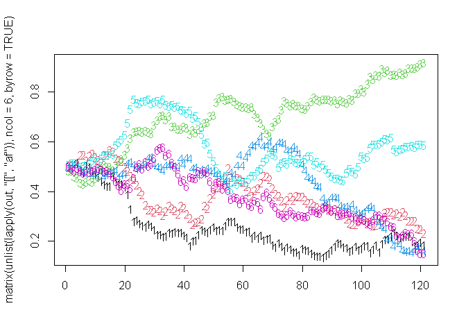

## Overview

`**magenta**` is an individual-based simulation model of malaria epidemiology and parasite genetics. It is thus well suited for simulating resistance.  

---


```r
# Load the package
library(magenta)
```

## Demonstration 

### Base Model

The `magenta` simulation model is run using the `pipeline` function, which handles creating needed parameter objects, starting the simulation, summarising the simulation model state at desired intervals and handling how to save the final model output and state. See Introduction vignette for more detail.

For example to run the model for 10 years with 1000 people and 40% treatment coverage:


```r
out <- pipeline(years = 10, N = 1000, EIR = 1, ft = 0.4)
## Seed set to 233992617
## magenta v1.3.0
```

In our return object by default, it returns just the Loggers. In this, there is a list called "Treatments" which gives us some information on treatments given out:


```r
str(out$Loggers$Treatments)
## List of 5
##  $ Successful_Treatments         : num 573
##  $ Unsuccesful_Treatments_LPF    : num 0
##  $ Not_Treated                   : num 844
##  $ daily_bite_counters           : int 1073094
##  $ daily_infectious_bite_counters: int 5515
```

(See [Loggers vignette](https://ojwatson.github.io/magenta/articles/loggers.html) for more info about what is returned in Loggers). 

The `Unsuccessful_Treatments_LPF` is the total number of failed treatments, defined as a 28-day late parasitological treatment failure (LPF). By default, `magenta` assumes a perfect drug with no treatment failure regardless of resistance. To start simulating resistance we need to understand a little bit more about how loci in `magenta` work. 

In a simulation, we can set the number of genetic parasite loci we track. These loci can also be used to encode information about the resistance phenotype of the parasite. For example, let's now run a simulation assuming DHA-PPQ is being used as the first line therapy. 


```r
out <- pipeline(EIR = 1, N = 1000, years = 10, ft = 0.4, 
                human_only_full_save = FALSE, full_save = TRUE,
                drug_list = drug_list_create(drugs = list(magenta:::drug_create_dhappq()))
                )
## Seed set to 580843526
## magenta v1.3.0
```
We have used the `full_save` option above so we can have a look at all the model output. If we look at the parameter list in the model return we can see what drug is being used in terms of the properties that the model uses:


```r
out <- pipeline(EIR = 1, N = 1000, years = 10, ft = 0.4, 
                human_only_full_save = FALSE, full_save = TRUE,
                update_save = TRUE, summary_saves_only = FALSE,
                drug_list = drug_list_create(drugs = list(magenta:::drug_create_dhappq()))
                )
## Seed set to 7718812
## magenta v1.3.0
## Starting Stochastic Simulation for 10 years
## Running: [==========================================================================================================================================] 100% eta: 
```

It is a list of lists (here just being a list of one list). Each of the lists is a drug being used. Since we only specified for one drug to be used (DHA-PPQ) we only have one drug here. The information above shows the properties we encode for a drug in `magenta`, which is created using `drug_create()` (see documentation for more info). The main information is which postions in the parasite genetic barcode are related to drug resistance. Here, we can see that the first 6 positions (0:5) are related to drug properties, with the locus at barcode positon 5 relating to prophylaxis, i.e. the partner drug. Because there are 6 loci related to drug resistance, the vector that determines the propbability of LPF (`m_lpf`) is 64 long (2^6), and represents the probability of LPF for each genotype, i.e. for each combination of the first 6 loci. When an individual is treated, the probability that they fail treatment is equal to the probability of LPF for the parasite that triggered the symptomatic infection (if there is more than one parasite then the lowest probability across all triggering parasites). 

For 6 loci modelled in magenta for drug resistance are crt76, mdr1 86 and 184, mdr1 copy number, kelch13 580 and plasmepsion-2,3 copy number in that order. Each loci is binary in nature, i.e. wild type (0) or resistant (1). So for DHA-PPQ, the loci that relate to resistance are 4 and 5 (the last 2). (For full table of drugs etc see `magenta::drug_table`) As a result we may expect under DHA-PPQ, these loci to increase over time:


```r
out <- pipeline(EIR = 1, N = 1000, years = 10, ft = 0.4, 
                update_length = 30,
                update_save = TRUE, 
                human_update_save = TRUE,
                summary_saves_only = TRUE,
                genetics_df_without_summarising = TRUE,
                full_update_save = TRUE,
                num_loci = 6,
                drug_list = drug_list_create(drugs = list(magenta:::drug_create_dhappq()))
)
## Seed set to 29293988
## magenta v1.3.0
## Starting Stochastic Simulation for 10 years
## Running: [==========================================================================================================================================] 100% eta: 0s
```
So let's have a look at the allele frequency (af) over time


```r
matplot(matrix(unlist(lapply(out, "[[", "af")), ncol = 6, byrow = TRUE))
```

<!-- -->
Huh, it doesn't. Why? Because we have a lot of control over when resistance is allowed to be modelled. We do this by using the `drug_list` more that we supply to `pipeline`:


```r
# let's create a drug
drug_list <- drug_list_create(
      resistance_flag = c(rep(FALSE, 5), rep(TRUE, 10)), # 5 years not modelling it followed by 10 modelling it
      mft_flag = FALSE,
      artemisinin_loci = 5,
      absolute_fitness_cost_flag = FALSE,
      partner_drug_ratios = 1,
      drugs = list(magenta:::drug_create_dhappq()),
      cost_of_resistance = rep(1, 6),
      sequential_cycling = -1,
      number_of_drugs = 1,
      sequential_update = -1,
      number_of_resistance_loci = 6
    )

out <- pipeline(EIR = 1, N = 10000, years = 15, ft = 0.4, 
                update_length = 30,
                update_save = TRUE, 
                human_update_save = TRUE,
                summary_saves_only = TRUE,
                genetics_df_without_summarising = TRUE,
                full_update_save = TRUE,
                num_loci = 6,
                drug_list = drug_list)
## Seed set to 481191969
## magenta v1.3.0
## Starting Stochastic Simulation for 15 years
## Running: [==========================================================================================================================================] 100% eta: 0s
```
And plot it:


```r
matplot(matrix(unlist(lapply(out, "[[", "af")), ncol = 6, byrow = TRUE))
abline(v = 60)
```

<!-- -->

By having resistance be switched on, we are thus able to allow a population to reach equilibrium without the effects and then have it come on when ready. So for example, imagine we wanted to simulate artemisinin resistance being neutral in the population and existing at 10% population level allel frequency (plaf) along with PPQ resistance and then initiate DHA-PPQ being used. We can do this as follows:


```r
out <- pipeline(EIR = 1, N = 10000, years = 15, ft = 0.4, 
                update_length = 30,
                update_save = TRUE, 
                human_update_save = TRUE,
                summary_saves_only = TRUE,
                genetics_df_without_summarising = TRUE,
                full_update_save = TRUE,
                num_loci = 6,
                drug_list = drug_list,
                # use the spatial importation here to have 100% of new infection to be imported
                # for first 5 yeaers. This means they are drawn from the plaf
                spatial_incidence_matrix = c(rep(1,5),rep(0,10)),
                spatial_mosquitoFOI_matrix = c(rep(1,5),rep(0,10)),
                spatial_type = "island",
                # set up the plaf to be used for the first 5 years to be 1% kelch & plasmepsin
                plaf=matrix(c(rep(c(0,0,0,0,0.1,0.1),5),rep(0,6*10)),ncol=6,byrow=TRUE))
## Seed set to 430911093
## magenta v1.3.0
## Starting Stochastic Simulation for 15 years
## Running: [==========================================================================================================================================] 100% eta: 0s
```

```r
matplot(matrix(unlist(lapply(out, "[[", "af")), ncol = 6, byrow = TRUE))
abline(v = 60)
```

<!-- -->

## Summary

That is all I have had time to write so far. But there are sufficient options so far to look at the following:

* DHA-PPQ, AL, ASAQ
* Resistance arising through mutation
* Resistance arising through importation
* Multiple First Line Therapies vs Sequential Therapies
* Setting your own drug properties
* Deciding how much of each drug to use in MFT and which drugs to cycle
* Deciding the thresholds for which cycling occurs at
* Lots of other features I have not had time/forgotten about to explain
